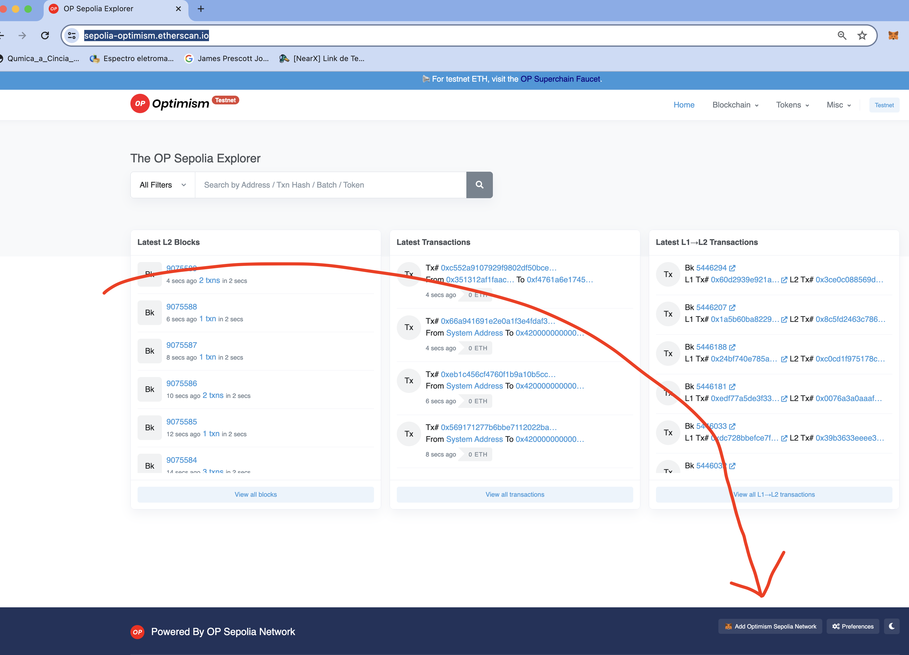
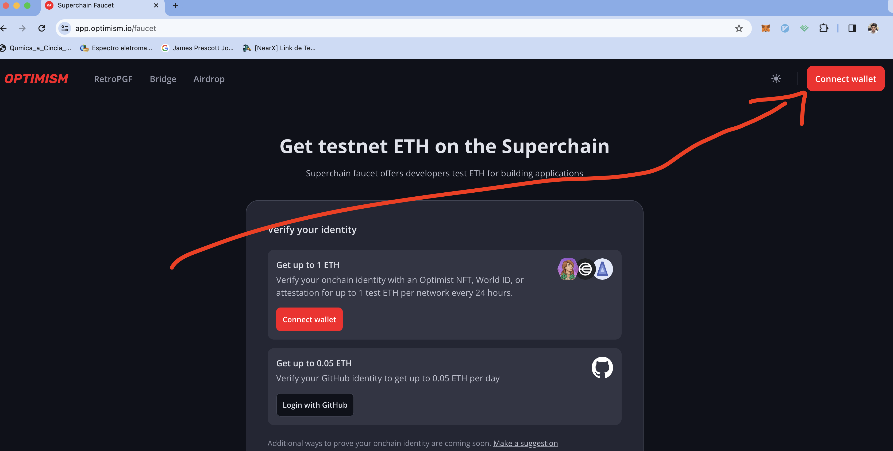
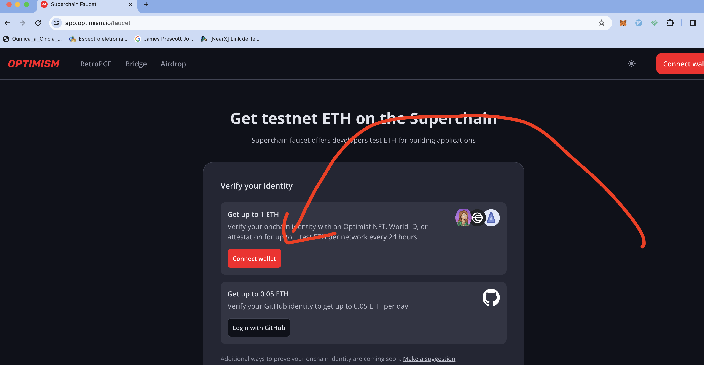

# Blockchain Layers and Optmism

Layer -1: Linguagem de programação: Go, Rust

Layer 0: Framework: CosmoSDK, -, PolkadotSDK (Substrate)

Layer 1: App: DyDx, Ethereum, Polkadot

Layer 2: Superset: Optimism, Polygon, Arbitrum

## L0, L1, L2, L3

## L2 Rollups - Optimism

## Deploy ERC20

Contrato completo sem otimização de Gas

```bash
forge install openZeppelin/openzeppelin-contracts@v5.0.2 --no-commit
```

Contrato resumido em Assembly com otimização de Gas

```bash
forge i Vectorized/solady@v0.0.177 --no-commit
```

## Airdrop

Lista dos endereços que receberam airdrop no script [Airdrop.s.sol](script/airdrop.s.sol#L9)

### Como ver o token na minha wallet?

- Adicione o token `0x177Ad3aD54715A84Fa906705c7F7660444d7d6e1`
- Adicione a rede correta Optimism Sepolia:
  1. Vá em: https://sepolia-optimism.etherscan.io/
  2. Clique em 

### Como transaferir o token?

- Vc precisa de ETH pra pagar a taxa pegue grátis aqui: https://app.optimism.io/faucet
  - Primeiro conecte sua Wallet: 
  - Segundo pegue seu Faucet: 

### Como ver na Block Explorer

- https://sepolia-optimism.etherscan.io/token/0x177ad3ad54715a84fa906705c7f7660444d7d6e1
  > No rodapé do explorer tambem tem um botão pra adicionar a rede na sua wallet.


